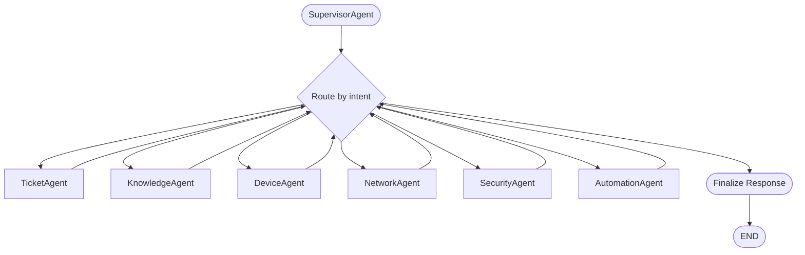

# Architecture

## Runtime Components

- Backend API: FastAPI app in backend/app/main.py with async SQLAlchemy services.
- Frontend: React/Vite app in frontend/src for chat, ticketing, analytics, RCA, screenshot, and voice workflows.
- LLM stack: Ollama chat models for intent, RCA, manager summaries, and vision parsing.
- RAG stack: FAISS vector index with incremental add_documents path for AI-generated KB growth.
- Data: PostgreSQL domain tables for tickets, approvals, audits, RCA, remote assist actions, and employee profiles.

## Multi-Agent Graph (LangGraph)

The chat orchestrator was refactored to a LangGraph supervisor model in backend/app/agent/orchestrator.py. Specialist nodes are composed and chainable.

## Phase 9 Workflow Additions

1. RCA pipeline
	- Service: backend/app/services/rca_service.py
	- Endpoint: POST /api/v1/tickets/{id}/analyze-root-cause
	- Trigger: also on resolved ticket transitions.

2. Autonomous resolution with hard rails
	- Service: backend/app/services/automation_agent_service.py
	- Endpoint: POST /api/v1/tickets/{id}/autonomous-resolve
	- Enforcement: Full-Auto policy only, max 1 retry, mandatory AuditLog writes.

3. Predictive incident detection
	- Service: backend/app/services/monitoring_service.py
	- Background task starts in app lifespan, plus POST /api/v1/monitoring/check-now.

4. AI knowledge builder
	- Service: backend/app/services/knowledge_builder_service.py
	- Incremental FAISS updates in backend/app/rag/vector_store.py.

5. Screenshot understanding
	- Endpoint: POST /api/v1/chat/upload-screenshot
	- Service: backend/app/services/vision_service.py

6. Voice help desk
	- Endpoints: POST /api/v1/voice/transcribe, POST /api/v1/voice/speak
	- Service: backend/app/services/voice_service.py

7. Remote assistant, permission-first
	- Endpoints: /api/v1/remote-assist, /approve, /execute
	- Service: backend/app/services/remote_assistant_service.py
	- Constraint: allow-listed scripts only, explicit approval required.

8. Employee digital twin
	- Model: EmployeeProfile
	- Service: backend/app/services/employee_profile_service.py
	- Loaded by supervisor context for personalized agent behavior.

9. Executive NL analytics
	- Endpoint: POST /api/v1/analytics/ask
	- Service: backend/app/services/manager_agent_service.py
	- Safety: constrained, whitelisted query-plan execution.
